# NBA Analytics Database 2024-25 Season

A fully normalized PostgreSQL database for NBA 2024-25 season analytics, built from scratch using the NBA API. This project demonstrates database design, data engineering, and sports analytics skills through comprehensive data modeling 
and querying.

## Project Overview

This project extracts real-time NBA data via API, processes and normalizes it into a relational database (3NF), and provides analytical queries to extract performance insights for teams and players during the 2024-25 season.

**Key Features:**
- Fully normalized database schema (3NF)
- 6 interconnected tables with referential integrity
- 25,000+ game/player statistics records
- Automated data extraction via `nba_api`
- Complex analytical queries for performance insights
- Support for multiple competition types (Regular Season, Playoffs, NBA Cup)

---

## Database Schema

```mermaid
erDiagram
    season_type ||--o{ games : "has"
    teams ||--o{ games : "plays_home"
    teams ||--o{ games : "plays_away"
    teams |o--o{ players_2024_25 : "has"
    games ||--o{ team_game_stats : "has"
    teams ||--o{ team_game_stats : "participates"
    games ||--o{ player_stats_2024_25 : "has"
    players_2024_25 ||--o{ player_stats_2024_25 : "performs"

    season_type {
        bigint season_id PK
        varchar competition
    }

    teams {
        bigint team_id PK
        varchar full_name
        varchar abbreviation
        varchar nickname
        varchar city
        varchar state
        bigint year_founded
    }

    players_2024_25 {
        bigint player_id PK
        bigint team_id FK "nullable"
        text first_name
        text last_name
        text player_slug
        text position
        date birth_date
        integer height_cm
        double_precision weight
        text country
        text school
        bigint season_exp
        double_precision jersey
        text rosterstatus
        text games_played_current_season_flag
        double_precision debut_year
        double_precision to_year
        text dleague_flag
        text nba_flag
        text games_played_flag
        text draft_year
        text draft_round
        text draft_number
        varchar former_team
    }

    games {
        bigint game_id PK
        bigint season_id FK
        date game_date
        bigint home_team_id FK
        bigint away_team_id FK
    }

    team_game_stats {
        bigint game_id PK
        bigint team_id PK
        text wl
        bigint min
        bigint pts
        bigint fgm
        bigint fga
        double_precision fg_pct
        bigint fg3m
        bigint fg3a
        double_precision fg3_pct
        bigint ftm
        bigint fta
        double_precision ft_pct
        bigint oreb
        bigint dreb
        bigint reb
        bigint ast
        bigint stl
        bigint blk
        bigint tov
        bigint pf
        double_precision plus_minus
    }

    player_stats_2024_25 {
        bigint game_id PK
        bigint player_id PK
        text nickname
        integer seconds_played
        bigint pts
        bigint reb
        bigint ast
        bigint stl
        bigint blk
        bigint tov
        bigint fgm
        bigint fga
        double_precision fg_pct
        bigint fg3m
        bigint fg3a
        double_precision fg3_pct
        bigint ftm
        bigint fta
        double_precision ft_pct
        bigint oreb
        bigint dreb
        bigint blka
        bigint pf
        bigint pfd
        bigint plus_minus
        double_precision nba_fantasy_pts
        bigint dd2
        bigint td3
        double_precision wnba_fantasy_pts
        bigint gp_rank
        bigint w_rank
        bigint l_rank
        bigint w_pct_rank
        bigint min_rank
        bigint fgm_rank
        bigint fga_rank
        bigint fg_pct_rank
        bigint fg3m_rank
        bigint fg3a_rank
        bigint fg3_pct_rank
        bigint ftm_rank
        bigint fta_rank
        bigint ft_pct_rank
        bigint oreb_rank
        bigint dreb_rank
        bigint reb_rank
        bigint ast_rank
        bigint tov_rank
        bigint stl_rank
        bigint blk_rank
        bigint blka_rank
        bigint pf_rank
        bigint pfd_rank
        bigint pts_rank
        bigint plus_minus_rank
        bigint nba_fantasy_pts_rank
        bigint dd2_rank
        bigint td3_rank
        bigint wnba_fantasy_pts_rank
        bigint available_flag
        bigint team_count
    }
```

### Tables Structure

**Core Entities:**
- `teams` - 30 NBA teams (id, name, city, abbreviation, etc.)
- `players_2024_25` - Active players for 2024-25 season
- `season_type` - Competition phases (Regular Season, Playoffs, Preseason, NBA Cup)
- `games` - Individual games with date and teams

**Performance Data:**
- `team_game_stats` - Team statistics per game (many-to-many resolution between teams and games)
- `player_stats_2024_25` - Player statistics per game

**Normalization:**
- **1NF**: All attributes contain atomic values
- **2NF**: No partial dependencies (e.g., `game_date` stored only in `games`, not in stats tables)
- **3NF**: No transitive dependencies (e.g., `team_name` referenced via FK, not duplicated)

---

##️ Technologies Used

- **Database**: PostgreSQL 14+
- **Python**: 3.11+
- **Libraries**: 
  - `nba_api` - NBA data extraction
  - `pandas` - Data manipulation
  - `SQLAlchemy` - Database ORM
  - `psycopg2` - PostgreSQL adapter
- **Tools**: pgAdmin, Jupyter Notebook

---

## Sample Analytical Queries

--- 

### 1. Top 10 Scorers (2024-25 Season)
```sql
SELECT 
    p.first_name,
    p.last_name,
    p.position,
    t.abbreviation as team,
    COUNT(*) as games_played,
    ROUND(AVG(ps.pts), 1) as avg_pts,
    ROUND(AVG(ps.reb), 1) as avg_reb,
    ROUND(AVG(ps.ast), 1) as avg_ast
FROM player_stats_2024_25 ps
JOIN players_2024_25 p ON ps.player_id = p.player_id
JOIN teams t ON p.team_id = t.team_id
GROUP BY p.player_id, p.first_name, p.last_name, p.position, t.abbreviation
HAVING COUNT(*) >= 10
ORDER BY avg_pts DESC
LIMIT 10;
```
---

### 2. Triple-Double Leaders
```sql
SELECT p.first_name, p.last_name, p.position, t.abbreviation as team, COUNT(*) as triple_double                                                                                                                                   
FROM player_stats_2024_25 ps                                                                                                                                                                                   
JOIN players_2024_25 p ON ps.player_id = p.player_id                                                                                                                                                                                              
JOIN teams t ON p.team_id = t.team_id                                                                                                                                                                                
WHERE ps.pts >= 10 AND ps.reb >= 10 AND ps.ast >= 10
GROUP BY p.player_id, p.first_name, p.last_name, p.position, t.abbreviation                                                                                                                   
ORDER BY triple_double DESC; 
```
---

### 3. Home Court Advantage Analysis
```sql
SELECT 
    t.full_name,
    ROUND(AVG(CASE WHEN g.home_team_id = t.team_id THEN tgs.pts END), 1) as avg_home_pts,
    ROUND(AVG(CASE WHEN g.away_team_id = t.team_id THEN tgs.pts END), 1) as avg_away_pts,
    ROUND(
        AVG(CASE WHEN g.home_team_id = t.team_id THEN tgs.pts END) - 
        AVG(CASE WHEN g.away_team_id = t.team_id THEN tgs.pts END), 1
    ) as home_advantage
FROM team_game_stats tgs
JOIN teams t ON tgs.team_id = t.team_id
JOIN games g ON tgs.game_id = g.game_id
GROUP BY t.team_id, t.full_name
ORDER BY home_advantage DESC
LIMIT 10;
```

**Key Insight:** NBA teams average ~3.5 points higher at home vs. away.

---

### 4. Per-36-Minutes Efficiency
```sql
SELECT 
    p.first_name,
    p.last_name,
    t.abbreviation as team,
    COUNT(*) as games,
    ROUND((SUM(ps.pts) * 2160.0 / SUM(ps.seconds_played)), 1) as pts_per_36min,
    ROUND((SUM(ps.reb) * 2160.0 / SUM(ps.seconds_played)), 1) as reb_per_36min,
    ROUND((SUM(ps.ast) * 2160.0 / SUM(ps.seconds_played)), 1) as ast_per_36min
FROM player_stats_2024_25 ps
JOIN players_2024_25 p ON ps.player_id = p.player_id
JOIN teams t ON p.team_id = t.team_id
WHERE ps.seconds_played > 0
GROUP BY p.player_id, p.first_name, p.last_name, t.abbreviation
HAVING SUM(ps.seconds_played) >= 6000
ORDER BY pts_per_36min DESC
LIMIT 15;
```

---

### 5. Performance by Competition Type
```sql
SELECT 
    st.competition,
    COUNT(DISTINCT g.game_id) as num_games,
    ROUND(AVG(tgs.pts), 1) as avg_team_pts,
    ROUND(AVG(tgs.fg_pct)::NUMERIC * 100, 1) as avg_fg_pct
FROM team_game_stats tgs
JOIN games g ON tgs.game_id = g.game_id
JOIN season_type st ON g.season_id = st.season_id
GROUP BY st.competition
ORDER BY num_games DESC;
```

---

## Installation & Setup

### Prerequisites
- PostgreSQL 14 or higher
- Python 3.11+

### Step 1: Clone Repository
```bash
git clone https://github.com/IgnaLS/nba-analytics-database.git
cd nba-analytics-database
```

### Step 2: Install Dependencies
```bash
pip install -r requirements.txt
```

### Step 3: Create Database
```bash
# In PostgreSQL
CREATE DATABASE nba_analytics;
```

### Step 4: Run Scripts
```bash
# Restore complete database from dump
psql -U postgres -d nba_analytics -f data/nba_analytics_dump.sql
```

This will create all tables, relationships, and load 30,000+ records.

---

## Project Structure
```
nba-analytics-database/
│
├── README.md
├── requirements.txt
├── .gitignore
├── nba_analytics_dump.sql (SQL Script)
└── data/
    └── (CSV backups)

```

---

## Key Insights

- **Database Size**: +30,000 records across 6 tables
- **Season Coverage**: Preseason through Finals (June 2025)
- **Normalization**: Full 3NF compliance with zero data redundancy

---

## Future Improvements

- [ ] Add advanced metrics (TS%, PER, Win Shares)
- [ ] Integrate shot location data (X, Y coordinates)
- [ ] Build interactive dashboard (Plotly/Streamlit)
- [ ] Extend to multi-season analysis
- [ ] Implement automated daily updates

---

## Data Sources

- **NBA API**: Official NBA statistics via `nba_api` Python wrapper
- **Documentation**: [NBA API GitHub](https://github.com/swar/nba_api)

---

## Author

**Ignazio Leonardo Scarpelli**

Data Science graduate with Sport Management background, currently interning at CONI (Italian Olympic Committee) for Milano-Cortina 2026 Winter Olympics.

- **LinkedIn**: https://www.linkedin.com/in/ignazio-leonardo-scarpelli-827044237/
- **Email**: ignazioleonardos@gmail.com

---

## License

This project is open source and available under the MIT License.

---

## Acknowledgments

- NBA API community

---

**Last Updated**: December 2025  
**Status**: ✅ Production-ready

